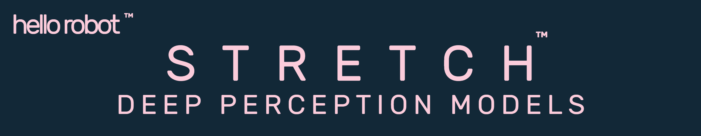

## Overview

*stretch_deep_perception_models* provides open deep learning models from third parties for use with the Stretch mobile manipulators from Hello Robot Inc. 

This repository should be located under ~/stretch_user/ on the robot.

The stretch_deep_learning directory found within the stretch_ros repository has code that uses these models.

https://github.com/hello-robot/stretch_ros/

## License

For license information, please see the LICENSE files. 
